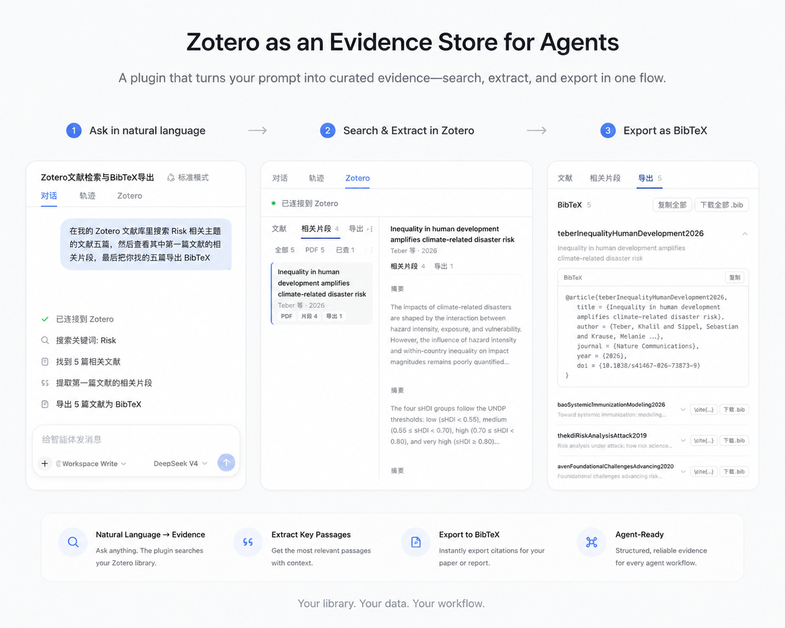

<div align="center">

# dsh-zotero


<p align="center">
  <a href="https://www.npmjs.com/package/dsh-zotero"></a>
  <a href="https://www.npmjs.com/package/dsh-zotero"></a>
  <a href="https://www.npmjs.com/package/dsh-zotero"></a>
  <a href="https://awesome-dsh-plugin.com"></a>
</p>
</div>

<p align="center">
  <a href="README.md"><b>中文</b></a> · <b>English</b>
</p>

dsh-zotero is a [Zotero](https://www.zotero.org) plugin designed for agent research workflows. Agents can search your library directly, view metadata and notes, extract evidence passages relevant to a question, open source PDFs, and generate citations and bibliographies.

<p align="center">
  
</p>

## Tools

| Tool                | Purpose                                                                         |
| ------------------- | ------------------------------------------------------------------------------- |
| `zotero_search`     | Search by title/creator/year; `everything` mode also searches indexed full text |
| `zotero_get`        | Read one item's metadata, optionally with notes, annotations, and attachments   |
| `zotero_retrieve`   | Return the most relevant evidence passages for a query                          |
| `zotero_attachment` | Resolve a ref to a verified on-disk path or linked URL                          |
| `zotero_export`     | Generate citations, bibliographies, BibTeX/BibLaTeX/RIS/CSL JSON                |

[Full tool reference →](docs/tools.md)

## Install

```sh
dsh plugin --profile <name> add dsh-zotero
```

From GitHub source:

```sh
dsh plugin --profile <name> add github:Vncntvx/dsh-zotero
```

From a local tarball:

```sh
cd dsh-zotero && npm pack
dsh plugin --profile <name> add ./dsh-zotero-*.tgz
```

After installing, start a new session so the agent picks up the Zotero tools.

The plugin provides a settings card under **Settings → Plugins** where you can adjust the API address, concurrency limits, full-text retrieval toggle, and more. Changes take effect on save. See [Configuration](docs/configuration.md).

[Installation details →](docs/getting-started.md)

## Requirements

- Zotero ≥ 7 with local API enabled: **Settings → Advanced → "Allow other applications on this computer to communicate with Zotero"**
- Node.js ≥ 22.19 (or ≥ 24)
- dsh 0.1.0-rc.7 series host (all `@deepseek-ai/dsh-*` peer dependencies are `^0.1.0-rc.7`)
- Local API at `http://127.0.0.1:23119/api`, unauthenticated, read-only

## Usage example

The agent calls tools step by step during a conversation. Each result becomes context for the next step.

```text
User: Find papers about Risk
Agent → zotero_search(query: "Risk", itemType: "journalArticle")
       5 matches; user picks the first 3

User: What does the first one's abstract say?
Agent → zotero_get(ref: 1, fields: ["abstractNote"])
       Returns the full abstract

User: Find the methodology discussion in this paper
Agent → zotero_retrieve(query: "methodology", sources: ["fulltext", "notes"])
       Returns relevant passages with page numbers

User: Export all three as BibTeX
Agent → zotero_export(refs: [1,2,3], format: "bibtex")
       Generates BibTeX entries, ready to copy or download
```

More examples in [Features](docs/features.md).

## Limits

- **Read-only library**: all operations are reads; items, notes, tags, and collections are unchanged
- **Loopback only**: network requests go only to `127.0.0.1:23119`
- **Evidence ranking is term-based**: BM25 ranks passages by query-term frequency match
- **Exports are static text**: returned as text, ready to copy into your target document
- **Full-text evidence depends on Zotero's index**: unindexed PDFs yield no full-text passages
- **Attachment depth depends on the harness**: `zotero_attachment` returns the file location; reading the PDF further needs a matching host capability

## Permissions and external side effects

- **Network**: HTTP requests go only to `http://127.0.0.1:23119/api` (redirects are not followed); `resolveConfig` enforces a loopback address
- **Filesystem**: read-only — `zotero_attachment` verifies attachment paths with `existsSync`; no file writes
- **Persistence**: the only write comes from the settings card under Settings → Plugins, saved to the `zotero:` user layer of `$DSH_HOME/settings.yaml`
- **No shell / native / background tasks**: the plugin runs no shell commands, loads no native modules, and starts no daemon
- **Restart**: after installing or removing the plugin, restart dsh and start a new session; configuration changes hot-reload on save without a restart

## Documentation

| Doc                                        | Covers                                                 |
| ------------------------------------------ | ------------------------------------------------------ |
| [Getting Started](docs/getting-started.md) | Installation, prerequisites, first verification        |
| [Features](docs/features.md)               | Sources panel, chat integration, evidence, exports     |
| [Tool Reference](docs/tools.md)            | Parameters, return values, error codes for all 5 tools |
| [Configuration](docs/configuration.md)     | 20 config fields, defaults, hot-reload                 |
| [Architecture](docs/architecture.md)       | Data flow, layer responsibilities, design boundaries   |
| [Development](docs/development.md)         | Build, test, local development                         |
| [Troubleshooting](docs/troubleshooting.md) | 11 common issues with symptoms and fixes               |

## Development

```sh
npm install --no-workspaces   # this repo lives inside the deepseek-harness workspace
npm test                      # vitest unit tests against the mock Zotero server
npm run typecheck             # tsc --noEmit for node, test, and client projects
npm run build                 # tsc emits node half into lib/; esbuild emits browser half lib/client.js
npm run dev                   # tsc --watch for host half hot reload
npm run dev:client            # esbuild --watch for browser half hot reload
```

Build output splits into `lib/` (Node side) and `lib/client.js` (browser side — settings card + Zotero tab). For full plugin development with both halves, use the `dev-lib.cordis.yml` overlay. See [Development](docs/development.md) for details.

## License

[MIT](./LICENSE) — free to use, modify, and distribute.
