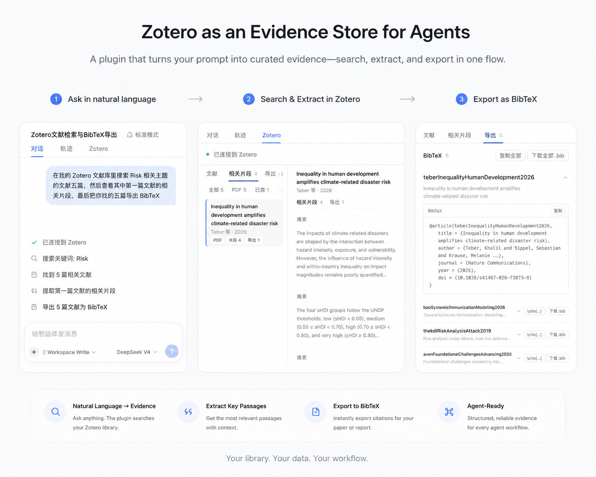

<div align="center">

# dsh-zotero


<p align="center">
  <a href="https://www.npmjs.com/package/dsh-zotero"></a>
  <a href="https://www.npmjs.com/package/dsh-zotero"></a>
  <a href="https://www.npmjs.com/package/dsh-zotero"></a>
  <a href="https://github.com/deepseek-ai/deepseek-harness/releases/tag/dsh-v0.2.0-rc.2"></a>
  <a href="https://awesome-dsh-plugin.com"></a>
</p>
</div>

<p align="center">
  <a href="README.en.md"><b>English</b></a> · <b>中文</b>
</p>

dsh-zotero 是面向 Agent 研究工作流的 [Zotero](https://www.zotero.org) 插件。Agent 可以直接检索文献库、读取元数据与笔记、提取相关证据段落、定位原文 PDF，并生成学术引用与参考文献。

<p align="center">
  
</p>

## 安装

从 npm 安装（推荐）：

```sh
dsh plugin --profile <name> add dsh-zotero
```

从 GitHub 预构建分支安装：

```sh
dsh plugin --profile <name> add github:Vncntvx/dsh-zotero#release
```

> **从 main 源码分支安装说明**：直接从 `github:Vncntvx/dsh-zotero`（默认 main 分支）安装需在本地执行构建脚本。pnpm 默认拦截依赖构建，需在 profile 的 `pnpm-workspace.yaml` 中配置 `allowBuilds`。推荐直接使用 `#release` 分支安装预构建版本。

从本地 tarball 安装：

```sh
cd dsh-zotero && npm pack
dsh plugin --profile <name> add ./dsh-zotero-*.tgz
```

安装后新建会话即可使用 Zotero 工具。

插件在 **设置 → Zotero** 中提供配置页，支持调整 API 地址、并发限制、全文检索等参数，保存即生效。详见 [配置参考](docs/configuration.md)。

[快速入门 →](docs/getting-started.md)

## 工具

| 工具                | 用途                                                                   |
| ------------------- | ---------------------------------------------------------------------- |
| `zotero_search`     | 按标题、作者、年份或全文索引搜索，支持库、合集、保存搜索与出版物作用域 |
| `zotero_browse`     | 浏览库结构：库列表、合集层级树、保存搜索、标签分面、条目类型与字段     |
| `zotero_get`        | 读取单篇文献的结构化元数据，可选加载笔记、批注与附件列表               |
| `zotero_children`   | 探索条目子对象图：直接笔记、附件及挂在 PDF 下的批注                    |
| `zotero_retrieve`   | 基于 BM25 按查询词提取最相关的证据段落，支持多附件检索                 |
| `zotero_changes`    | 基于本地事务版本感知增量变更与删除记录                                 |
| `zotero_attachment` | 将文献或附件 ref 解析为验证后的本地文件路径或链接 URL                  |
| `zotero_export`     | 生成格式化引用、参考文献表，以及 BibTeX、BibLaTeX、RIS、CSL JSON 导出  |

[工具参考 →](docs/tools.md)

## 前置条件

- Zotero ≥ 7 桌面版（读取需 Zotero ≥ 7，写入需 Zotero 10）。在 Zotero 中开启本地 API：**设置 → 高级 → 允许此计算机上的其他应用程序与 Zotero 通信**。
- Node.js ≥ 22.19 或 ≥ 24
- 宿主 dsh ≥ 0.2.0-rc.2
- 本地 API 地址 `http://127.0.0.1:23119/api`；读取无需认证，写入使用本地签发的 write key

## 使用示例

Agent 在对话中按需调用工具，工具输出作为后续步骤的上下文：

```text
用户：帮我找 Risk 相关的论文
Agent → zotero_search(query: "Risk", itemTypes: ["journalArticle"])
       5 篇匹配结果，用户选择前 3 篇

用户：第一篇的摘要说了什么？
Agent → zotero_get(ref: "zotero://user/0/item/ABCD1234")
       返回摘要全文

用户：这篇里关于方法论的讨论，帮我找出来
Agent → zotero_retrieve(ref: "zotero://user/0/item/ABCD1234", query: "methodology",
                        sources: ["fulltext", "note"])
       返回相关段落，附带页码与来源标注

用户：把这三篇导出为 BibTeX
Agent → zotero_export(refs: ["zotero://user/0/item/ABCD1234",
                             "zotero://user/0/item/EFGH5678",
                             "zotero://user/0/item/IJKL9012"], format: "bibtex")
       生成 BibTeX 条目，支持在界面中复制或下载
```

更多示例见 [功能概览](docs/features.md)。

## 限制

- **只读保护**：默认只读。仅在显式开启 `writeEnabled` 后提供笔记创建、标签与合集管理工具；每次写入均需通过审批卡和 Zotero 本地授权确认。
- **检索机制**：段落检索基于 BM25 关键词频匹配；全文段落依赖 Zotero 本地全文索引，未建立索引的 PDF 无法提取文本。
- **附件处理**：`zotero_attachment` 仅解析并校验本地附件路径；阅读文件内容取决于宿主环境的文件处理能力。
- **导出形式**：导出工具返回纯文本（如 BibTeX、RIS、CSL JSON），支持在面板中复制或直接下载。

## 权限

- **网络访问**：仅向本地 `http://127.0.0.1:23119/api` 发起 HTTP 请求，强制绑定 loopback 环回地址，不跟随重定向，无外部网络访问。
- **文件与系统**：文件系统只读（仅通过异步 `stat` 校验附件存在性），不执行 shell 命令，不调用本地二进制原生模块，不运行常驻守护进程。
- **数据持久化**：插件配置保存在 `$DSH_HOME/settings.yaml`；授权时若选择“始终允许”，写入密钥保存在宿主凭据管理器中。
- **生命周期**：配置变更保存即生效；安装或卸载插件需重启宿主生效。

## 说明文档

| 文档                                | 内容                                     |
| ----------------------------------- | ---------------------------------------- |
| [快速入门](docs/getting-started.md) | 安装步骤、前置条件与连接验证             |
| [功能概览](docs/features.md)        | 来源面板、对话集成、证据提取与导出工作流 |
| [工具参考](docs/tools.md)           | 全部 11 个工具的参数、返回值与错误码     |
| [配置参考](docs/configuration.md)   | 36 个配置字段、默认值与热更新机制        |
| [系统架构](docs/architecture.md)    | 数据流、分层职责与设计边界               |
| [开发指南](docs/development.md)     | 构建、测试、调试与发布流程               |
| [使用场景](docs/scenarios.md)       | 真实对话验收用例与日常使用示例           |
| [故障排查](docs/troubleshooting.md) | 常见问题诊断与处理方法                   |

## 许可证

[MIT](./LICENSE)
