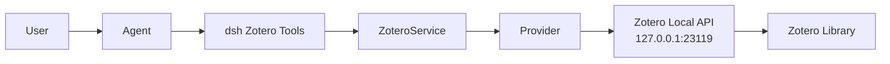

<a href="architecture.md"><b>中文</b></a>

# Architecture

## Overview

dsh-zotero is a Cordis service plugin that exposes a `ctx.zotero` service boundary. The loader mounts the default export with the row's validated config.

## Data flow

User → Agent → dsh Zotero Tools → ZoteroService → Provider → 127.0.0.1 Zotero Local API → Zotero Library

## Key layers

### Service layer (`src/service.ts`)

- `ZoteroService` extends `Service`, registered as `ctx.zotero`
- Handles provider selection, capability gating, domain methods
- Config is live: uses settings section when attached, otherwise composition entry
- `rebuild()` creates HTTP client and local provider from current config
- Request-driven: loading never touches Zotero

### Provider layer (`src/provider-local.ts`)

- `LocalApiProvider` implements `ZoteroProvider`
- Capabilities: search, metadata, attachments, fulltext, citation
- Client-side scope resolution (Local API has no server-side name search)
- Note body scan: client-side first page (offset 0), limited by maxNoteScanRecords
- Evidence ranking: BM25 over passage corpus (annotations, notes, abstract, fulltext chunks)
- Export: citation batches follow API's 50-key limit; translator formats capped at 50 refs

### HTTP transport layer (`src/http-client.ts`)

- Pure loopback fetch, fixed API version (`Zotero-API-Version: 3`)
- Instance identity protection (`Zotero-Server-ID` header)
- Stream response byte limit (`maxResponseBytes`)
- No redirect following, no connection pooling, no background work
- Timeout via deadline fusion with caller cancellation

### Evidence pipeline (`src/evidence.ts`)

- Tokenization: `Intl.Segmenter` word segmentation (CJK-aware)
- BM25 ranking (k1=1.2, b=0.75) over passage corpus
- Document frequency is passage-level (rarer in the item's own passages scores higher)
- Ties preserve caller passage order (deterministic)
- Zero-score passages excluded (passages with no query-term match do not enter results)

### Browser client (`src/client/`)

- Settings card: Settings → Plugins tab, bound to `zotero` namespace via `settingsScope`
- Sources tab: `conversation.view` slot, session snapshot of literature/evidence/exports
  - Sources sub-view: stable union of search hits and referenced items
  - Evidence sub-view: passages grouped by item, with Zotero page labels
  - Exports sub-view: successful export artifacts with format/style/locale
- Connection bar: probed once on tab open, once on refresh (no polling)
- `zotero://` deep links: "Open in Zotero", "Open PDF", "Open annotation"
- `webEnabled` toggle: takes effect immediately, no reload needed

### Remote/Typert

- `ZoteroRuntime` provides real-time connectivity for the web tab via the wire namespace
- Strict manifest declares endpoints through the Typert registry

### Settings

- Namespace `zotero` in `$DSH_HOME/settings.yaml`
- `installSettingsSection` as composition entry base layer
- Hot-reload: `onChange` rebuilds HTTP client and provider

## Design boundaries

- **Library**: read-only. No path modifies items, notes, tags, or collections.
- **Network**: loopback only (127.0.0.1, localhost, ::1). Redirects rejected.
- **No background polling**, no telemetry, no persistent tasks.
- **Evidence**: term-based BM25, ranking by query-word frequency match against passages.
- **Sources tab**: session snapshot, showing items referenced in this conversation.
- **Exports**: static text, returned as text, ready to copy.
- **PDF reading**: attachments return path/URL; further reading requires host capability.
