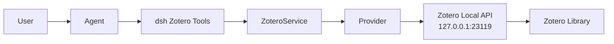

<a href="architecture.md"><b>中文</b></a>

# Architecture

## Overview

dsh-zotero is a Cordis service plugin that exposes a `ctx.zotero` service boundary. The loader mounts the default export with the row's validated config.

## Data flow

User → Agent → dsh Zotero Tools → ZoteroService → Provider → 127.0.0.1 Zotero Local API → Zotero Library

## Key layers

### Service layer (`src/service.ts`)

- `ZoteroService` extends `Service`, registered as `ctx.zotero`
- Handles provider selection, capability gating, domain methods
- Config treats the Loader entry (the composition entry) as the single authority; settings commits land on that same entry through `loader/volatile-update`
- Structural volatile updates call the private `buildTransport()` to rebuild the HTTP client, local provider, and write-tool set on the **same** `ZoteroService` instance; limit-only updates are read live and do not rebuild transport
- The connectivity recovery gate (`ConnectivityRecovery` / `service.recovery`) lives for the service instance and is **not** reset by settings rebuilds (resetting would stack duplicate cards for concurrent failures)
- The write gate sits on the **service seam**: the three write methods require a `ZoteroWriteCall` (plan markdown plus the asking agent and signal), answer the capability gate before the plan card, return `declined` without approving, and fail closed with no channel; the write tools no longer run the plan review themselves
- A `tools/pre-execute` listener raises a shell command aimed at Zotero's local write API into a harness approval request (`src/shell-write-detector.ts`, no switch): a confirmation runs that one call, and a rejection / cancellation / `never` policy / missing channel runs nothing. Detection reads command text; see the write boundaries for its limits
- Request-driven: loading never touches Zotero

### Provider layer (`src/local/provider.ts`)

- `LocalApiProvider` implements `ZoteroProvider`
- Capabilities: search, metadata, attachments, citation, browse, retrieve, changes; optional write support is exposed only when its transport and authorizer are wired
- Client-side scope resolution (Local API has no server-side name search)
- Read-path fan-out is parallel, with a mechanism per domain: one key's two children listings use `Promise.all` (`src/local/detail.ts`); retrieve's attachment set and export's per-document requests use bounded concurrency (`ZOTERO_GRAPH_CONCURRENCY` / `ZOTERO_EXPORT_CONCURRENCY`); browse ancestor resolution and the changes item partitions use `Promise.all` / `Promise.allSettled`. The write path's request minimum (one POST per note, no read-back) is stated in the [tools doc](./tools.en.md) write boundaries
- Note body scan: client-side first page (offset 0), limited by maxNoteScanRecords
- Evidence ranking: BM25 over passage corpus (annotations, notes, abstract, fulltext chunks)
- Export: citation batches follow API's 50-key limit; translator formats capped at 50 refs

### HTTP transport layer (`src/http-client.ts`)

- Pure loopback fetch, fixed API version (`Zotero-API-Version: 3`)
- Instance identity protection (`Zotero-Server-ID` header)
- Stream response byte limit (`maxResponseBytes`)
- A per-instance in-flight request bound (`ZOTERO_MAX_INFLIGHT_REQUESTS`, default 8): each domain pool only bounds one call's fan-out and concurrent tool calls multiply it, so the HTTP client holds the slots itself for the whole request, connection and streamed body included. A queued request is cancellable, and its deadline starts once it holds a slot, so waiting in the queue is never reported as Zotero timing out
- No redirect following, no connection pooling, no background work
- Timeout via deadline fusion with caller cancellation

### Evidence pipeline (`src/evidence.ts`)

- Tokenization: `Intl.Segmenter` word segmentation (CJK-aware), with tokens folded by Zotero's own `normalizeForSearch` (diacritics, NFKD-special letters, typographic quotes and dashes, formatting tags) so matching agrees with the server-side search; the fold never rewrites the returned text
- BM25 ranking (k1=1.2, b=0.75) over passage corpus
- Document frequency is passage-level (rarer in the item's own passages scores higher)
- Ties preserve caller passage order (deterministic)
- Zero-score passages excluded (passages with no query-term match do not enter results)

### Browser client (`src/client/`)

- Settings page: `settings.section` slot (its own left-nav entry in the Settings panel), reading the `zotero` namespace's shared form via `ctx.configForms.get`
- Sources tab: `conversation.view` slot, session snapshot of literature/evidence/exports
  - Sources sub-view: stable union of search hits and referenced items
  - Evidence sub-view: passages grouped by item, with Zotero page labels
  - Exports sub-view: successful export artifacts with format/style/locale
- Connection bar: probed once on tab open, once on refresh (no polling)
- Tool call cards: dedicated `tool.call.toolview` cards (keyed by all 11 model tool names), providing compact, read-only collapsible views with inline copy actions and `zotero://` deep links for search, retrieval, exports, item details, children, and write operations
- `zotero://` deep links: "Open in Zotero", "Open PDF", "Open annotation"
- `webEnabled` toggle: takes effect immediately, no reload needed

### Remote/Typert

- `ZoteroRuntime` provides real-time connectivity for the web tab via the wire namespace
- Strict manifest declares endpoints through the Typert registry

### Settings

- Namespace `zotero` lives on the Loader entry (the composition entry is the single authority)
- Every field is `volatile`: limits are read live by the provider; when transport fields or the write gate change, `loader/volatile-update` rebuilds the transport stack and write-tool set on the same service instance, while provider id is selected live per call

## Design boundaries

- **Library**: read-only by default; `writeEnabled` explicitly opts into writing the personal library (notes, tags, collection membership). See the write boundaries.
- **Network**: loopback only (127.0.0.1, localhost, ::1). Redirects rejected.
- **No background polling**, no telemetry, no persistent tasks.
- **Evidence**: term-based BM25, ranking by query-word frequency match against passages.
- **Sources tab**: session snapshot, showing items referenced in this conversation.
- **Exports**: the tool returns text (that is what the model reads); the panel offers copy and file download.
- **PDF reading**: attachments return path/URL; further reading requires host capability. The path belongs to the machine running Zotero. The loopback pin keeps the plugin on that machine, but a host may run file access in another environment (sandbox, container, remote worker) where the path is not visible. The tool result states that environment, and the plugin never solves remote access by opening Zotero's unauthenticated port.
