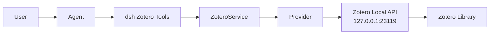

<a href="architecture.md"><b>中文</b></a>

# Architecture

## Overview

dsh-zotero is a Cordis service plugin exposing the `ctx.zotero` service boundary. The loader mounts the default `ZoteroService` export alongside its validated configuration.

## Data Flow

```mermaid
graph LR
    U[User] --> A[Agent]
    A --> T[dsh Zotero Tools]
    T --> S[ZoteroService]
    S --> P[Provider]
    P --> Z[Zotero Local API<br/>127.0.0.1:23119]
    Z --> L[Zotero Library]
```

## Core Layers

### Service Layer (`src/service.ts`)

- `ZoteroService` extends Cordis `Service`, registered as `ctx.zotero`;
- Orchestrates providers, capability gates, and unified domain entrypoints;
- Treats the Loader entry as authoritative; settings commits apply via `loader/volatile-update` to the same entry;
- Structural configuration updates rebuild the HTTP client, provider, and write tools on the active instance: the six keys in `TRANSPORT_CONFIG_KEYS` (`baseUrl`, `timeoutMs`, `maxResponseBytes`, `maxInFlightRequests`, `writeAuthorizeDeadlineMs`, `writeEnabled`). Every other limit is read live through the provider and does not rebuild;
- The connectivity recovery gate (`ConnectivityRecovery`) shares the service instance lifetime to avoid stacking duplicate prompts during concurrent failures;
- Write gates converge at the service boundary: all write calls receive a `ZoteroWriteCall` and must clear capability checks, session approval policy (`ctx.approval.request`), and plan review cards;
- Listens on `tools/pre-execute` to detect shell commands targeting the local API and escalate them to Harness approval requests;
- Request-driven architecture: plugin startup never issues background network requests.

### Provider Layer (`src/local/provider.ts`)

- `LocalApiProvider` implements the `ZoteroProvider` interface;
- Exposes search, metadata, attachments, citation, browse, retrieve, and changes capabilities; write capabilities require explicit configuration and authorization;
- Resolves search and browse scope names from its own cached scope listings; the scope directory holds those listings and rebuilds its caches with the transport;
- Bounded concurrency on fan-out reads (`searchConcurrency`, `graphConcurrency`) keeps one call from flooding the local API;
- Note content scans execute within configured record limits on the initial page (offset 0);
- Retrieved passages rank via the BM25 term frequency algorithm;
- Export operations stay inside the local API's batch limits: the four batch formats (`bibtex`, `biblatex`, `ris`, `csljson`) each fetch their items in one request (up to 50 keys per `itemKey` request) and never refetch an item alone. `ris` and `csljson` need only that call; `bibtex` and `biblatex` also fire one metadata batch in parallel (`fetchRawItemBatch`) to align the export back to each item;
- Write domain supports cross-library relations (`dc:relation`), automatically mapping group library items to canonical `http://zotero.org/groups/<id>/items/<key>` URIs.

### Background Job Engine (`src/job-runner.ts`)

- Integrates with Harness's `ctx.jobs` task subsystem;
- Supports explicit background execution (`run_in_background: true`) and automatic timeout promotion (`promoteOnTimeout: true`, governed by `foregroundWaitMs`);
- Signal decoupling: background jobs run under independent `AbortController` signals, so a turn timeout or a client cancellation leaves an active background job running;
- Channel isolation: progress updates stream through `{ channel: 'log' }` to the session header and log stream without polluting model context; completed payloads write to `JobOutcome.result`;
- On-demand lifecycle: no persistent daemon polling processes.

### HTTP Transport Layer (`src/http-client.ts`)

- Restricts network calls to loopback HTTP, pinning the API version to 3;
- Verifies instance identity using the `Zotero-Server-ID` header;
- Enforces streaming response body size limits (`maxResponseBytes`);
- Enforces a process-wide in-flight request bound (`maxInFlightRequests`, default 8), managing concurrency slots across all tools;
- Follows no redirects and uses no persistent connections;
- Coordinates timeouts through a fused deadline and the caller's cancellation signal.

### Passage Retrieval Pipeline (`src/evidence.ts`)

- Tokenization: uses `Intl.Segmenter` (CJK-aware) with folding aligned to Zotero's `normalizeForSearch`; folding applies only to matching, preserving verbatim text in output;
- BM25 ranking parameters: k1=1.2, b=0.75;
- Document frequency evaluates against the item's own passage corpus;
- Excludes zero-scoring passages: a passage that shares no term with the query is not considered relevant, so a query with no overlap returns an empty list rather than arbitrary excerpts.

### Browser Client (`src/client/`)

- Settings Page (`settings.section`): registers a dedicated Zotero page in the Settings panel left navigation;
- Session Panel (`conversation.view`): the conversation tab shows one Zotero panel, with a top lens bar switching between the sources workspace and the session-wide exports page. Each source's inspector holds an Overview panel, a Passages panel for retrieved passages, and an Exports panel for that item's exported documents;
- Tool Cards (`tool.call.toolview`): a compact, collapsible card for each of the 16 model tools (8 read and 8 write), with copy actions on the values worth copying and deep links into Zotero. A card renders output the tool already produced and never calls the tool itself;
- Command Status Card (`conversation.chat.commandview`): renders connectivity status, the version and Server ID details, diagnosis tips, and an in-place refresh button for `/zotero`;
- `webEnabled` takes effect immediately upon saving.

### Remote Communication and Settings

- The host half registers `ZoteroRuntime` under the `zotero` wire namespace. Its one endpoint returns the live connectivity view; configuration reads and writes travel through the harness's shared settings form, not this channel;
- The browser half mounts that namespace itself: `apply` awaits `ctx.remote.$mount(ZOTERO_REMOTE)`, then registers every surface on a fiber that declares `remote.zotero` (`ctx.inject(['remote.zotero', …], registerUi)`) and reads it as `ctx.remote.zotero`. A failed mount is not swallowed: the entry rejects and the harness reports the plugin as failed to load;
- All configuration fields are declared `volatile`, supporting hot reload.

## Design Boundaries

- **Library Permissions**: read-only by default; `writeEnabled` allows writes to personal libraries (`zotero://user/0/`) only;
- **Network Boundaries**: loopback only (`127.0.0.1`, `localhost`, `::1`); rejects external connections and redirects;
- **Process Management**: no background daemon polling or telemetry collection; long-running tasks are managed on demand by `ctx.jobs`;
- **Passage Ranking**: BM25 term frequency matching over the item's own passage corpus, with no vector or embedding model;
- **Session Snapshot**: Sources panel displays literature referenced within the active conversation.
