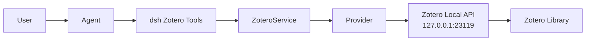

<a href="architecture.md"><b>中文</b></a>

# Architecture

## Overview

dsh-zotero is a Cordis service plugin exposing the `ctx.zotero` service boundary. The loader mounts the default `ZoteroService` export alongside its validated configuration.

## Data Flow

```mermaid
graph LR
    U[User] --> A[Agent]
    A --> T[dsh Zotero Tools]
    T --> S[ZoteroService]
    S --> P[Provider]
    P --> Z[Zotero Local API<br/>127.0.0.1:23119]
    Z --> L[Zotero Library]
```

## Core Layers

### Service Layer (`src/service.ts`)

- `ZoteroService` extends Cordis `Service`, registered as `ctx.zotero`;
- Orchestrates providers, capability gates, and unified domain entrypoints;
- Treats the Loader entry as authoritative; settings commits apply via `loader/volatile-update` to the same entry;
- Structural configuration updates (transports, write toggles) rebuild the HTTP client, provider, and write tools on the active instance; limit changes are read live without rebuilding;
- The connectivity recovery gate (`ConnectivityRecovery`) shares the service instance lifetime to avoid stacking duplicate prompts during concurrent failures;
- Write gates converge at the service boundary: all write calls receive a `ZoteroWriteCall` and must clear capability checks, session approval policy (`ctx.approval.request`), and plan review cards;
- Listens on `tools/pre-execute` to detect shell commands targeting the local API and escalate them to Harness approval requests;
- Request-driven architecture: plugin startup never issues background network requests.

### Provider Layer (`src/local/provider.ts`)

- `LocalApiProvider` implements the `ZoteroProvider` interface;
- Exposes search, metadata, attachments, citation, browse, retrieve, and changes capabilities; write capabilities require explicit configuration and authorization;
- Resolves search and browse scope names on the client side;
- Bounded concurrency across fan-out operations avoids overloading the local API;
- Note content scans execute within configured record limits on the initial page (offset 0);
- Evidence passages rank via the BM25 term frequency algorithm;
- Export operations adhere to local API batch size limits, using a zero-N+1 in-memory slicing engine for batch formats (`bibtex`, `biblatex`, `ris`, `csljson`) to complete exports in a single API call ($O(1)$ HTTP request) and eliminate secondary per-item fetching;
- Write domain supports cross-library relations (`dc:relation`), automatically mapping group library items to canonical `http://zotero.org/groups/<id>/items/<key>` URIs.

### Background Job Engine (`src/job-runner.ts`)

- Integrates with Harness's `ctx.jobs` task subsystem;
- Supports explicit background execution (`run_in_background: true`) and automatic timeout promotion (`promoteOnTimeout: true`, governed by `foregroundWaitMs`);
- Signal decoupling: background jobs run under independent `AbortController` signals, ensuring turn timeouts or client cancellations do not abort active background jobs;
- Channel isolation: progress updates stream through `{ channel: 'log' }` to the session header and log stream without polluting model context; completed payloads write to `JobOutcome.result`;
- On-demand lifecycle: no persistent daemon polling processes.

### HTTP Transport Layer (`src/http-client.ts`)

- Restricts network calls to loopback HTTP, pinning the API version to 3;
- Verifies instance identity using the `Zotero-Server-ID` header;
- Enforces streaming response body size limits (`maxResponseBytes`);
- Enforces a process-wide in-flight request bound (`maxInFlightRequests`, default 8), managing concurrency slots across all tools;
- Follows no redirects and uses no persistent connections;
- Coordinates timeouts through deadline fusion and caller cancellation signals.

### Evidence Pipeline (`src/evidence.ts`)

- Tokenization: uses `Intl.Segmenter` (CJK-aware) with folding aligned to Zotero's `normalizeForSearch`; folding applies only to matching, preserving verbatim text in output;
- BM25 ranking parameters: k1=1.2, b=0.75;
- Document frequency evaluates against the item's own passage corpus;
- Excludes zero-scoring passages to guarantee textual query relevance.

### Browser Client (`src/client/`)

- Settings Page (`settings.section`): registers a dedicated Zotero page in the Settings panel left navigation;
- Session Panel (`conversation.view`): provides Sources, Evidence, and Exports sub-views in the session tab;
- Tool Cards (`tool.call.toolview`): renders compact, read-only collapsible cards for all 16 model tools (8 read and 8 write), with inline copy actions and deep links;
- Command Status Card (`conversation.chat.commandview`): renders connectivity status, telemetry, diagnostic tips, and an in-place refresh button for `/zotero`;
- `webEnabled` takes effect immediately upon saving.

### Remote Communication and Settings

- `ZoteroRuntime` provides real-time state communication over the wire namespace;
- All configuration fields are declared `volatile`, supporting hot reload.

## Design Boundaries

- **Library Permissions**: read-only by default; `writeEnabled` allows writes to personal libraries (`zotero://user/0/`) only;
- **Network Boundaries**: loopback only (`127.0.0.1`, `localhost`, `::1`); rejects external connections and redirects;
- **Process Management**: no background daemon polling or telemetry collection; long-running tasks are managed on demand by `ctx.jobs`;
- **Evidence Ranking**: based on BM25 term frequency matching rather than vector semantic embeddings;
- **Session Snapshot**: Sources panel displays literature referenced within the active conversation.
