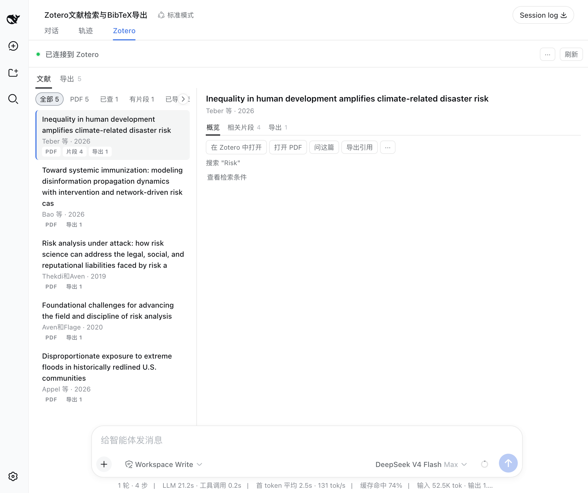
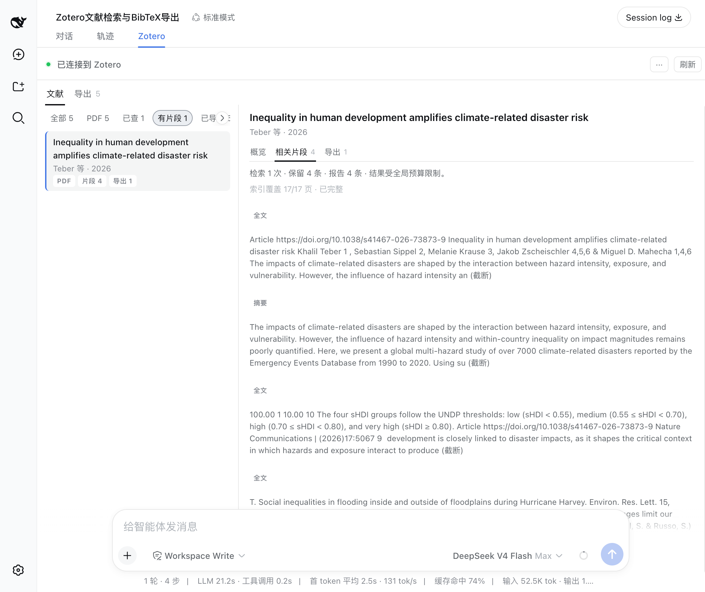
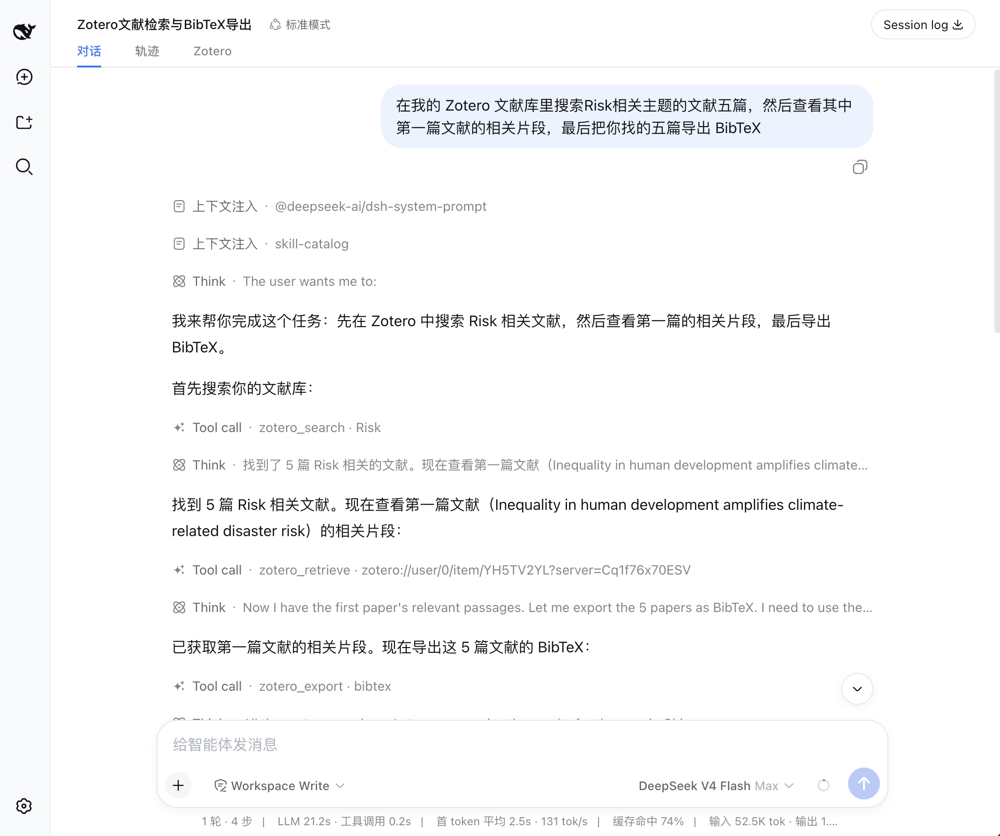

<a href="features.md"><b>中文</b></a>

# Features

dsh-zotero allows DSH LLM conversations to search, inspect, and cite your local Zotero library. Sixteen tools cover literature discovery, passage retrieval, source attachment location, formatted export, and personal-library writes. Eight personal-library write tools are disabled by default and require session approval and plan review when enabled. The web Sources panel aggregates literature, relevant passages, and exports referenced throughout the session.

## Literature Search

`zotero_search` invokes Zotero's local quick search:

- Search modes:
  - `metadata` (default): matches title, author, and year;
  - `everything`: additionally queries indexed full-text content.
- Search scopes:
  - Entire library (default);
  - Personal publications (`publications`);
  - Specific collection by name or ref (`collection`);
  - Specific saved search by name or ref (`savedSearch`).

Initial queries (offset 0) scan note bodies in batches, returning matches under `supplemental` without inflating the primary pagination count. Search results return stable `zotero://` references for downstream tools.

## Metadata and Notes

`zotero_get` retrieves structured bibliographic metadata for a single item, including title, creators, publication year, venue, DOI, URL, and abstract.

Use `include` to selectively load child resources:

- `notes`: child notes and their text content;
- `annotations`: PDF annotations, highlighted text, comments, and page labels;
- `attachments`: associated attachments with file types and link modes.

When a note body exceeds the character budget the response sets `truncated: true`, and a cut abstract sets `abstractTruncated: true`.

## Passage Retrieval

`zotero_retrieve` gathers text passages across multiple item sources and ranks them using the BM25 algorithm:

| Source       | Description                                                                                                            |
| ------------ | ---------------------------------------------------------------------------------------------------------------------- |
| `annotation` | PDF annotations: highlights and reader comments rank together with page labels; `matchedFields` indicates match origin |
| `note`       | Chunked child note body text                                                                                           |
| `abstract`   | Item abstract text                                                                                                     |
| `fulltext`   | Chunked full text from Zotero's local index                                                                            |

Full-text coverage is reported via the `coverage` field. Unavailable or unindexed sources are logged in `sourcesSkipped`.

Under multi-attachment policies (`allIndexed` or `specified`), the `attachments` array reports individual attachment status: `indexed` (full text and coverage retrieved), `unindexed` (no index built in Zotero), or `unread` (skipped due to attachment limit).

## Locating Source Attachments

`zotero_attachment` resolves attachment references to accessible locations:

- Local file: returns an on-disk path verified via async `stat`;
- Linked attachment: returns the target URL.

Passing an item ref lets Zotero select the best attachment automatically; passing an attachment ref targets that specific file.

Note: Reading PDF content depends on host environment capabilities; dsh-zotero resolves and validates the path.

## Citation Export

`zotero_export` supports the following output formats:

| Format         | Output                                          |
| -------------- | ----------------------------------------------- |
| `citation`     | Individual HTML citations ordered by input refs |
| `bibliography` | CSL-ordered consolidated bibliography           |
| `bibtex`       | BibTeX entries                                  |
| `biblatex`     | BibLaTeX entries                                |
| `ris`          | RIS text                                        |
| `csljson`      | CSL-JSON data                                   |

Optional `style` and `locale` parameters set the citation format. Requests exceeding 50 keys in `citation` mode are automatically batched.

## Optional Personal-Library Writes

When `writeEnabled` is turned on, the plugin registers 8 write tools restricted to the personal library (`zotero://user/0/`):

- `zotero_create_note`: creates standalone notes or child notes with tags, collections, and `dc:relation` links;
- `zotero_update_item_tags`: settles `add`/`remove` in one read-merge-write call, keeping existing tag types, under the item's version precondition;
- `zotero_update_item_collections`: settles `add`/`remove` membership changes in one call, resolving names before any write;
- `zotero_create_collection`: creates a top-level or child collection; a sibling with the same name refuses the write;
- `zotero_delete_collection`: deletes a collection (irreversible: its structure and child collections go, the items stay); the plan card states the item and subcollection counts first;
- `zotero_create_item`: creates an item from a closed field set (no BibTeX/CSL-JSON channel); an unknown type or a missing title and URL is refused;
- `zotero_update_item`: corrects scalar metadata, with field validity taken from Zotero's `itemTypeFields`;
- `zotero_delete_library_tags`: deletes tags library-wide by name (irreversible), stating each tag's item count first; unmatched names are ignored so a retry is idempotent.

Every write requires passing session approval policy and user plan card review, and both deletion tools state their irreversibility on the card. Zotero 10 also prompts a local authorization dialog on first write.

## Chat Tool Cards (Toolviews)

In DSH conversations, Zotero tool calls render using dedicated read-only cards (`tool.call.toolview`):

- **Search (`zotero_search`)**: displays queries, total hits, expandable item summaries, and deep links;
- **Passage Retrieval (`zotero_retrieve`)**: displays extracted passage counts, ranked excerpts, page numbers, and index coverage;
- **Export (`zotero_export`)**: shows format badges, copy actions, and formatted download buttons;
- **Item Details (`zotero_get`)**: displays bibliographic metadata, venue details, child item counts, and previews;
- **Child Objects (`zotero_children`)**: partitions child notes, attachments, and highlighted PDF annotations by kind;
- **Library Structure & Changes (`zotero_browse` / `zotero_changes`)**: `zotero_browse` renders collection trees and tag lists; `zotero_changes` displays versioned diffs, deletions, and reusable cursors;
- **Attachment Locator (`zotero_attachment`)**: displays verified file paths or links with one-click copy and open actions;
- **Personal Library Writes (all 8 write tools)**: displays target items, note summaries, planned tag and membership changes, collection/item creation and deletion, and library-wide tag deletion; receipts distinguish "applied", "no change", "outcome unreported", and "declined", with irreversible deletes declared on the plan card first.

Cards use compact summary headers by default and lazily render details when expanded, tracking tool lifecycle states throughout execution.

## Slash Command Status Card (Commandview)

Running `/zotero` (or `/zotero status`) in the chat composer renders a dedicated status card:

- Online/offline indicator and summary status;
- Local endpoint address, Zotero version, API and schema versions, Server ID, and write permission state (endpoint address remains visible when disconnected to aid diagnosis);
- Inline Refresh button to re-run local connectivity checks immediately;
- Actionable diagnostic steps when offline or encountering errors.

## Plugin Management and Activation Guidance

The plugin integrates with Harness plugin slots:

- **Activation Guidance (`plugins.bundle.activation`)**: opens an onboarding modal when enabling the plugin, checking local API connectivity and guiding users to enable communications in Zotero preferences;
- **Detail Page Status Section (`plugins.bundle.config` / `plugins.detail.section`)**: provides toggles for the Sources tab and for writes (`writeEnabled`), plus a live readiness card that reports connection state, the Zotero version, and diagnostic tips;

## Session Sources Panel

The Zotero tab in DSH Web includes two sub-views (Sources, Exports); Passages is a panel inside each item's inspector, with a session-wide overview entry when the session holds passages for several items:

- **Sources**: displays items referenced through search and read tools during the session; the item inspector carries a passages panel grouping the text excerpts `zotero_retrieve` extracted;
- **Exports**: lists all generated citation and bibliography text, with copy and download actions.

## Design Boundaries

- **Read-only by default**: `writeEnabled` is disabled by default; when enabled, writes apply only to the personal library and require dual confirmation;
- **Term frequency ranking**: passage retrieval matches terms with BM25, not vector embeddings;
- **Text exports**: citations and bibliographies return plain text;
- **Session isolation**: the Sources panel maintains an isolated snapshot for the active conversation;
- **Index dependency**: full-text search and retrieval rely on Zotero's local index.
