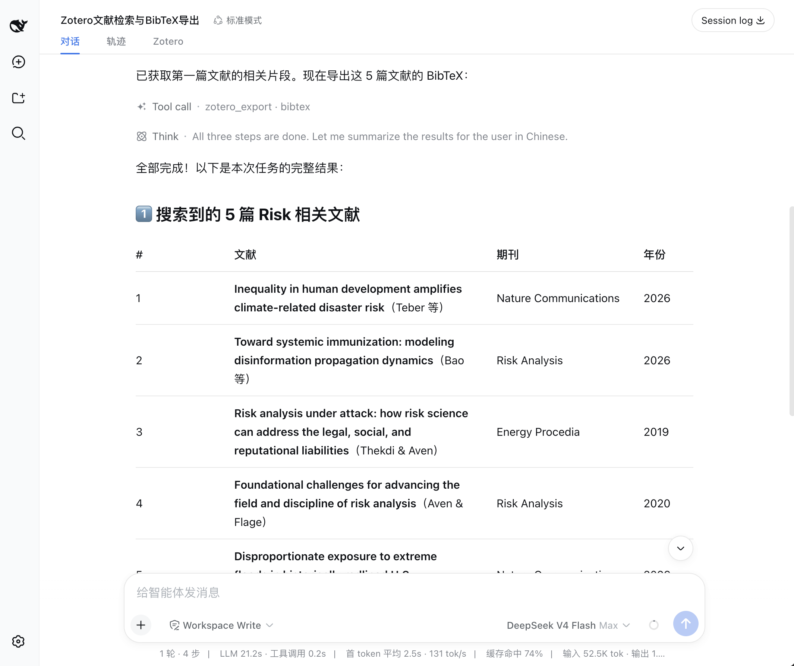
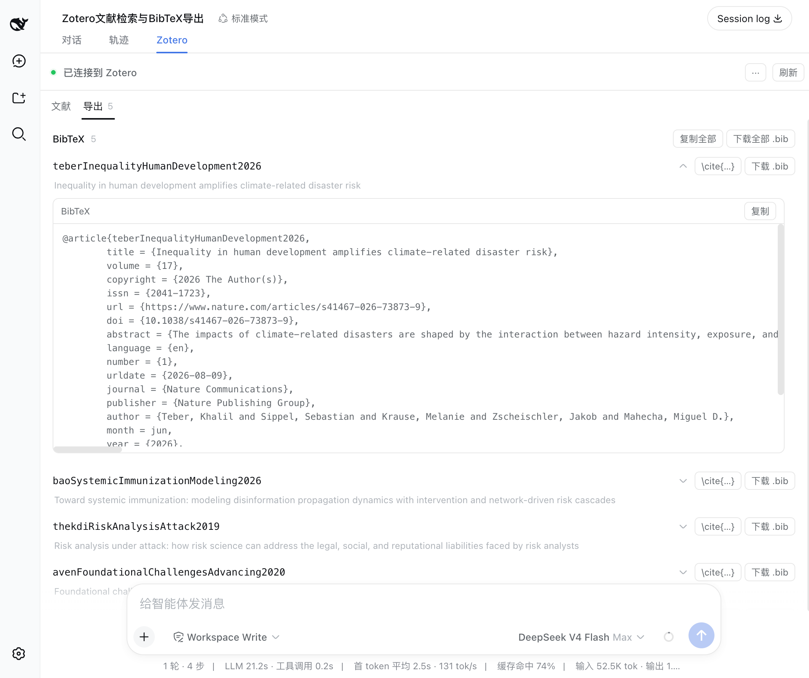

<a href="features.md"><b>中文</b></a>

# Features

dsh-zotero lets DSH's LLM conversations query a Zotero library directly. Eleven tools cover search, evidence extraction, and export; three personal-library write tools are off by default and, once enabled, still require the session approval policy, a plan card, and Zotero 10 local authorization. The web-side Sources panel shows literature, evidence, and citations for the session.

## Search

`zotero_search` calls Zotero's own quick search.

**Two search modes:**

- `metadata` (default) — matches title, author, year
- `everything` — also searches indexed full text

**Four search scopes:**

- Entire library (default)
- Personal publications (`publications`)
- By collection name or `zotero://` ref
- By saved search name or ref

The first page of results (offset 0) also scans note bodies. Matches are listed under `supplemental` (`kind: "noteBody"`) and do not count toward the pagination total. Search results return stable `zotero://` refs for use by subsequent tools.

Search results list and item action panel: title, author, year, type, and actions like "Open in Zotero", "Open PDF", "Ask about this paper", "Export citation".

## View metadata and notes

`zotero_get` reads a single item's metadata. By default it returns only basic fields like title, authors, DOI, and abstract.

Pass an `include` array to load child items:

- `notes` — child notes with their body text (has a character budget)
- `annotations` — PDF annotations, highlights, comments, page labels
- `attachments` — attachment list (type, link mode)

Notes and annotations each carry a `truncated` flag when they exceed their budget.

Evidence passages: relevant text segments grouped by source, showing page labels, index coverage, and source availability.

## Extract evidence

`zotero_retrieve` is the core information extraction tool. It collects text segments from four sources, ranks them with BM25, and returns the most relevant passages:

| Source       | Description                                                                                                                                     |
| ------------ | ----------------------------------------------------------------------------------------------------------------------------------------------- |
| `annotation` | PDF annotations: the highlight and the reader’s comment rank together, with Zotero’s page labels; `matchedFields` says which of the two matched |
| `note`       | Child note body text, chunked                                                                                                                   |
| `abstract`   | Item abstract                                                                                                                                   |
| `fulltext`   | Zotero-indexed full text, ranked by BM25 chunks                                                                                                 |

Evidence is a ranked result of existing text segments within an item, based on BM25 term-frequency matching. BM25 matches terms only: a query word that does not appear in a chunk will not appear in the results even when the content is semantically related.

Full-text index coverage is reported via the `coverage` field (indexed chars / total chars). When the index is incomplete, `complete: false` is flagged. Unavailable sources are logged in `sourcesSkipped`.

Under a multi-attachment policy (`allIndexed` / `specified`), `attachments` reports every full-text source the call considered with its `status`: `indexed` (read; carries `coverage`, `passages`, and whether the character budget cut it), `unindexed` (no full text for that file in Zotero’s index), `unread` (the call was already at its attachment limit). An unindexed supplement is recorded as a named coverage gap, never as "the supplement says nothing".

The agent calls search, retrieve, and export tools in sequence to fulfill a user request.

## Open source materials

`zotero_attachment` resolves an attachment ref to an accessible path:

- Local file → verified on-disk path
- Linked attachment → URL

Pass an item ref to let Zotero pick the best attachment automatically. Pass an attachment ref to target a specific one.

To open a `zotero://` deep link and view the item in Zotero, use the ref format `zotero://user/0/item/<KEY>`.

> **Limit:** Reading PDF full-text content requires host-side capability (e.g., local file reading). dsh-zotero resolves the path only and does not read file contents.

## Export citations

`zotero_export` supports six formats:

| Format         | Output                                 |
| -------------- | -------------------------------------- |
| `citation`     | Per-item HTML citations, in refs order |
| `bibliography` | CSL-sorted combined bibliography       |
| `bibtex`       | BibTeX entries                         |
| `biblatex`     | BibLaTeX entries                       |
| `ris`          | RIS format                             |
| `csljson`      | CSL-JSON                               |

Optional `style` and `locale` parameters set the citation style. In citation mode, refs lists exceeding Zotero's 50-key limit are batched automatically.

> **Note:** the tool returns exports as text; the panel offers copy and file download of the same content.

## Optional personal-library writes

After `writeEnabled` is explicitly enabled, three tools operate only on `zotero://user/0/`:

- `zotero_create_note` creates a standalone or child research note, optionally with tags, collections, and `dc:relation` sources.
- `zotero_add_tags` reads existing tags, merges safely, and writes under a version precondition.
- `zotero_add_to_collection` reads existing memberships, merges safely, and writes under a version precondition.

Every write shows a plan card before it happens, with no way to turn that off. Zotero 10 then issues a one-time or Always-Allow key through its local authorization dialog. Write tools never use the retrying connectivity ask.

## Chat Tool Cards (Toolviews)

In the DSH conversation interface, when the agent invokes Zotero tools, it no longer falls back to generic collapsed JSON trees. Instead, dsh-zotero registers dedicated read-only views (`tool.call.toolview`) for all 11 model tools:

- **Search (`zotero_search`)**: Shows the query and the call's own hit count (not the number of rows the card draws); expands to item cards with title, author, year badge, item-type badge, a PDF marker, and deep links to open the item in Zotero or view its PDF, plus a note of how many results were not listed individually.
- **Evidence Retrieval (`zotero_retrieve`)**: The folded summary line gives the number of passages the call found (not the number of rows the card draws); expanding shows the ranked passages with a per-source badge, the page label, and which field carried the query (text or comment), plus a one-line full-text index coverage figure (`x/y pages · complete / incomplete`) and a note of how many further passages the projection cap kept off the page. **No relevance score badge:** the BM25 score is only used to drop zero-scoring passages, is not comparable across sources, and is never put on the wire.
- **Export (`zotero_export`)**: Shows the normalized export format (BibTeX, CSL JSON, RIS, …), the citation style and locale tags, and a reference-count badge, with formatted citation text, one-click copy, and a download named for the format.
- **Item Details (`zotero_get`)**: Shows the item's title, authors, year, publication venue, whether it has a PDF, and deep links, plus a per-kind count of notes / annotations / attachments (with the true total and the number the card actually shows when the listing was capped) and the note and annotation previews the projection kept, with page labels and deep links.
- **Child Objects (`zotero_children`)**: Partitions child notes, PDF attachments, and PDF annotations by kind; annotations carry their page label and Zotero's own highlight colour, and link into the PDF they live in at that page.
- **Library Structure & Changes (`zotero_browse` / `zotero_changes`)**: `zotero_browse` names the browsed `kind` and shows "this page / total", lists rows per kind (collections indented by depth, tags with their counts, libraries with their identity), and points at the next page's offset. `zotero_changes` states the version range it compared, lists the changed keys per kind with their versions, puts the removals in their own section, and offers the cursor with a copy action. **The change total counts changes only, never removals.** Objects the read could not cover get their own section naming each kind, its reason, and the remedy; a read that withheld its cursor says so rather than reading as a settled range; the full-text section is marked as counting on the index's own counter.
- **Attachment Locator (`zotero_attachment`)**: Shows the resolved local disk path or URL link, with one-click copy and an Open PDF link.
- **Personal Library Writes (`zotero_create_note` / `zotero_add_tags` / `zotero_add_to_collection`)**: Shows the target item, the note summary (its first line), the requested tags, and the target collection, and states the outcome **as applied**: success, no change (every tag already present / the item was already a member), failure, declined, and "committed but not verified" — a caution state meaning the write must be treated as committed and must not be retried.

Cards default to a compact folded summary line and lazily render detailed payloads only upon expansion to ensure smooth UI scrolling, while providing full lifecycle awareness (Preparing, Running, Success, Stopped, Error, Declined, Committed-unverified).

> **Integration with Work Details presentation:** DSH's General settings provide a "Work details" preference (`compact` / `standard` / `detailed` / `verbose`). In the default "Standard" mode, finished turns fold process rows behind the turn summary; clicking the timer bar above the message expands the tool cards in place. If you prefer tool cards to stay expanded by default in history, switch the preference to "Verbose".

## Slash Command Status Card (Commandview)

When running `/zotero` (or `/zotero status`) in the chat composer, command execution output is rendered by a dedicated card registered in the `conversation.chat.commandview` slot (key: `zotero`):

- **Status indicator & collapsed summary**: The folded summary line displays a connectivity indicator dot (green online / red offline), the executed command name (`/zotero`), and a concise status line;
- **Structured metrics grid**: Expanding the card reveals **the local endpoint this probe actually dialled** (`127.0.0.1:23119` by default, following the `baseUrl` setting), Zotero client version, Local API version, schema version, database Server ID (if reported), and personal library write status (Enabled with stored key / Enabled without key / Disabled). The endpoint row is shown when disconnected too — the address that did not answer is the one worth checking;
- **Live re-probe action**: An inline "Refresh" button at the bottom of the expanded card triggers an immediate local probe to update all telemetry fields, with a yellow indicator during probing, without needing to retype the command. The button is present on an errored command and on output the parser does not recognize too, where the card shows raw text;
- **Offline diagnosis & guidance**: When disconnected or encountering errors, expanding the card displays actionable diagnosis hints (checking whether Zotero Desktop is running, verifying the local API toggle in Advanced preferences, etc.) and falls back to raw text for non-standard output.

## Plugin Management & Activation Guidance

dsh-zotero integrates deeply with the Harness Plugin Manager slots:

- **Activation Guidance (`plugins.bundle.activation`)**: When enabling the plugin in the Plugins list or clicking "Enable Now" after installation, an onboarding modal pops up automatically. It runs live connectivity diagnostics and clearly explains how to enable "Allow other applications on this computer to communicate with Zotero" in Zotero Preferences → Advanced to avoid 403 errors, offering one-click "Check Again" and direct navigation to "Open Details";
- **Quick Config & Status Section (`plugins.bundle.config` / `plugins.detail.section`)**: Provides quick switches on the plugin detail page for the Sources panel and write permission risk confirmation, alongside persistent API diagnostics and quick tips.

## Session Sources panel

The dsh web Zotero tab contains three sub-views:

### Sources

Shows items referenced through search and read tools in the current session: a snapshot of items involved in this conversation.

The agent formats search results into a structured table in the conversation.

### Evidence

Aggregates all evidence passages returned by `zotero_retrieve` calls, grouped by source.

### Exports

Lists all citation and bibliography text produced by export operations in the session.

BibTeX export view: each citation can be expanded to show the full entry, with one-click copy and .bib download.

## Settings page

The Settings panel's left navigation carries a dedicated **Zotero** page (beside General, Models, and Plugins). Changes take effect on save; tools read the latest config on each request.

Configurable items include the API address, read/export limits, citation style and locale, plus `writeEnabled`, `writePersistKey`, and `webEnabled`. See [Configuration](configuration.en.md).

## Design boundaries

- **Read-only by default:** `writeEnabled` is off by default; when enabled, writes remain personal-library-only and still pass the session approval policy, plan approval, version preconditions, and Zotero's local key protocol.
- **Ranking:** Evidence uses BM25 (term frequency), ranking by query-word match against passages.
- **Exports are text:** citations and bibliographies are returned as text; the panel can copy them or download them as a file.
- **Sources panel is a snapshot:** The Sources panel shows items referenced in this session, independent per session.
- **Full-text depends on index:** `everything` mode and `fulltext` evidence sources depend on Zotero's full-text index; incomplete indexes may omit results.
