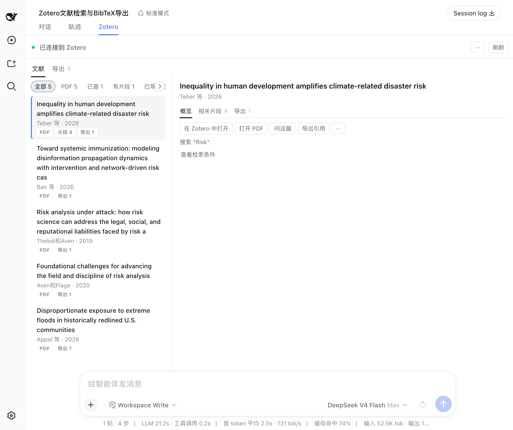
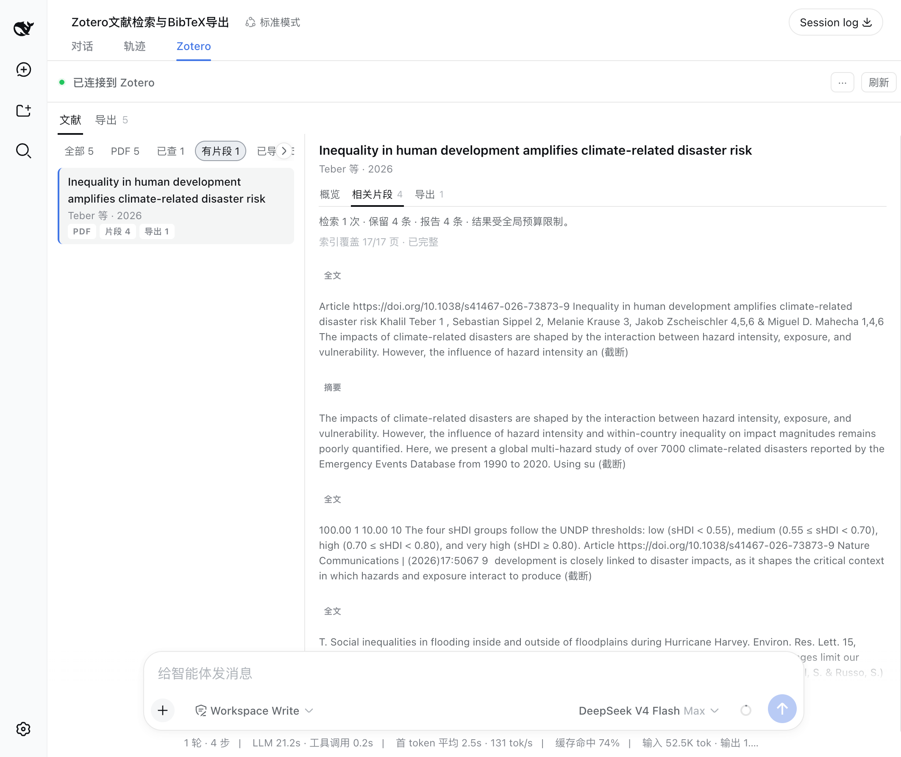
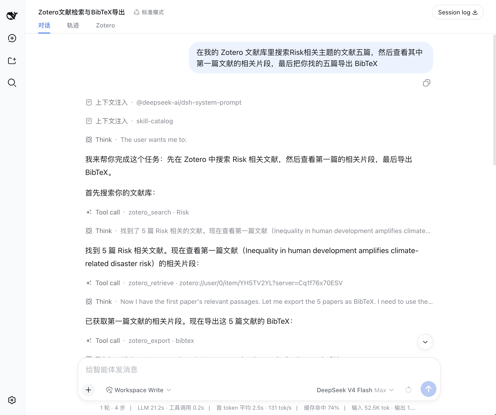
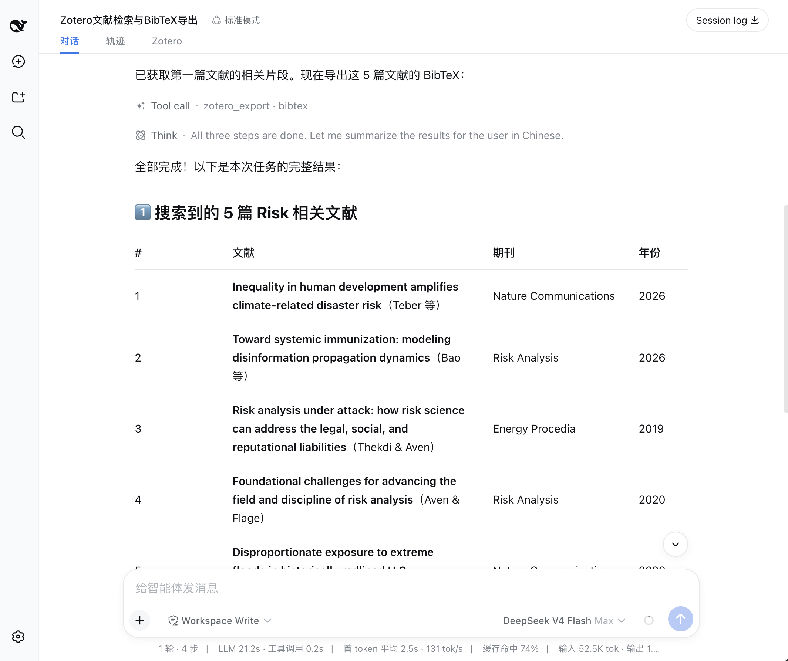
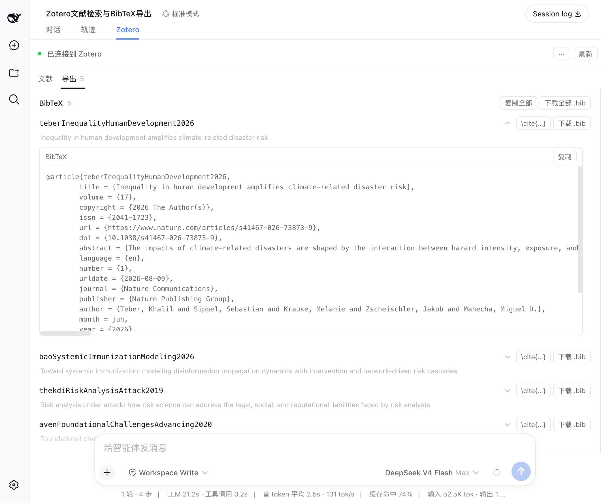

<a href="features.en.md"><b>English</b></a>

# 功能概览

dsh-zotero 让 DSH 的 LLM 对话直接查询你的 Zotero 文献库。五个工具覆盖从搜索到导出的完整工作流，配合 web 端的 Sources 面板实时展示会话中的文献、证据和引用。

## 搜索文献

`zotero_search` 调用 Zotero 自身的快速搜索。

**两种搜索模式：**

- `metadata`（默认）— 匹配标题、作者、年份
- `everything` — 额外搜索已索引的全文

**三种搜索范围：**

- 整个文献库（默认）
- 按集合名或 `zotero://` ref 指定 collection
- 按保存搜索的名称或 ref

第一页结果（`offset 0`）会额外扫描笔记正文，命中数通过 `noteMatches` 报告，不计入分页总数。搜索结果返回稳定的 `zotero://` ref，供后续工具使用。

搜索结果列表与条目操作面板：标题、作者、年份、类型，以及"在 Zotero 中打开""打开 PDF""问这篇""导出引用"等操作。

## 查看元数据与笔记

`zotero_get` 读取单条文献的元数据。默认只返回标题、作者、DOI、摘要等基本信息。

传入 `include` 数组可加载子项：

- `notes` — 子笔记及其正文（有字数上限）
- `annotations` — PDF 批注、高亮、评论、页码
- `attachments` — 附件列表（类型、链接模式）

笔记和批注各自带 `truncated` 标记，超出预算时按上限截断。

证据段落视图：按来源聚合的相关文本片段，显示页码、索引覆盖和来源可用性。

## 提取证据

`zotero_retrieve` 是核心的信息提取工具。它从四个来源收集文本片段，用 BM25 排序后返回最相关的段落：

| 来源         | 说明                                     |
| ------------ | ---------------------------------------- |
| `annotation` | PDF 批注和高亮文本，带 Zotero 自身的页码 |
| `note`       | 子笔记正文，按 chunk 分段                |
| `abstract`   | 条目摘要                                 |
| `fulltext`   | Zotero 索引的全文，按 BM25 chunk 排序    |

**什么是证据：** 证据是条目内部已有文本片段的排序结果，基于 BM25 词频匹配。BM25 只匹配词项，如果查询词没有出现在某个 chunk 中，即使内容在语义上相关也不会出现。

全文索引覆盖度通过 `coverage` 字段报告（已索引字符数/总字符数）。索引不完整时，`complete: false` 会明确标出。不可用的来源记入 `sourcesSkipped`。

Agent 依次调用搜索、检索、导出三个工具完成用户请求。

## 打开原文

`zotero_attachment` 将附件 ref 解析为可操作的路径：

- 本地文件 → 验证后的磁盘路径
- 链接附件 → URL

传入条目 ref 时，Zotero 自动选择最佳附件。传入 attachment ref 时，精确指定某一个附件。

要打开 `zotero://` 深链接在 Zotero 中查看条目，使用 `zotero://user/0/item/<KEY>` 格式的 ref。

> **限制：** 读取 PDF 全文内容需要宿主端能力（如本地文件读取），dsh-zotero 本身只负责解析路径，不读取文件内容。

## 导出引用

`zotero_export` 支持六种格式：

| 格式           | 输出                             |
| -------------- | -------------------------------- |
| `citation`     | 逐条 HTML 引用，按 refs 顺序排列 |
| `bibliography` | CSL 排序的合并参考文献列表       |
| `bibtex`       | BibTeX 条目                      |
| `biblatex`     | BibLaTeX 条目                    |
| `ris`          | RIS 格式                         |
| `csljson`      | CSL-JSON                         |

可选 `style` 和 `locale` 参数指定引用样式。citation 模式下 refs 列表超过 Zotero 的 50 键上限时自动分批。

> **注意：** 导出结果以文本形式返回，需要手动复制到目标位置。

## 会话来源面板

dsh web 界面的 Zotero 选项卡包含三个子视图：

### Sources（文献）

展示当前会话中通过搜索和读取工具引用的文献列表，只显示本次对话中涉及的条目快照。

Agent 将搜索结果整理为结构化表格呈现在对话中。

### Evidence（证据）

聚合所有 `zotero_retrieve` 调用返回的证据段落，按来源分组显示。

### Exports（导出）

列出会话中所有导出操作产生的引用和参考文献文本。

BibTeX 导出视图：每条引用可展开查看完整条目，支持一键复制和下载 .bib 文件。

## 配置卡片

在 Plugins 配置标签页中，dsh-zotero 提供设置卡片。修改配置后保存即生效，无需重启——工具在每次请求时读取最新配置。

可配置项包括：API 地址、搜索结果上限、证据段落数上限、导出条目上限、引用样式和区域设置等。详见 [配置文档](configuration.md)。

## 边界说明

- **只读：** dsh-zotero 只读访问文献库。
- **排序算法：** 证据排序使用 BM25（基于词频），按查询词与 passage 的匹配度排序。
- **导出是文本：** 引用和参考文献以文本形式返回，需要手动复制到目标位置。
- **来源面板是快照：** Sources 面板展示本次会话引用的条目，每次会话独立。
- **全文依赖索引：** `everything` 模式和 `fulltext` 证据来源依赖 Zotero 的全文索引，索引不完整时结果可能遗漏。
