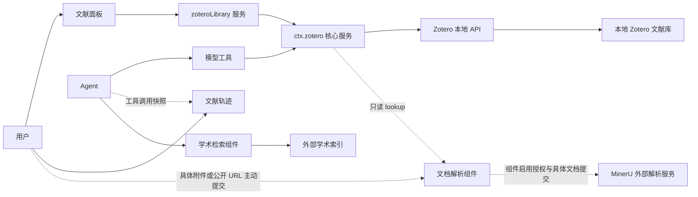

<a href="product-model.en.md"><b>English</b></a>

# 产品模型

dsh-zotero 围绕本机的 Zotero 文献库运行。模型走工具，人走界面，通过两个入口和两套视图分工协作，底层由四个组件支撑。

## 两个入口

系统为模型和用户提供独立的交互入口：

| 入口           | 使用者  | 交互方式                             | 职责                                                                        |
| :------------- | :------ | :----------------------------------- | :-------------------------------------------------------------------------- |
| **Agent 工具** | AI 模型 | 模型工具调用（Function Calling）     | 在对话中检索、阅读原文、定位出处片段、生成引用；经审批后修改文献库。        |
| **用户界面**   | 用户    | 浏览器界面（右侧面板与会话顶部标签） | 浏览整个文献库、筛选条目、阅读 PDF、复制引用；核对 Agent 调用的文献与出处。 |

### 互不代理原则

两条路径各司其职，互不代理：

- **界面与工具解耦**：面板里的「提问」与「加入对话」将文献条目信息填入输入框，由用户决定是否发送及如何提问；Web 界面不直接触发模型工具。
- **后台调用不影响视图**：Agent 在后台调用工具检索或研读文献，不改变用户在文献面板中的条目选中、合集树展开状态与滚动位置。

## 两个视图

本地 Zotero 是唯一的数据源。界面上提供两个视图，一个用来找文献，一个用来核对 Agent 做过的事：

| 视图         | 位置           | 定位                                                                                                      | 数据来源                              |
| :----------- | :------------- | :-------------------------------------------------------------------------------------------------------- | :------------------------------------ |
| **文献面板** | 右侧边栏       | **全局库视图**：供用户查阅与取用。浏览合集树、标签、保存的搜索与回收站，查看条目详情并阅读 PDF。          | 本地 API（通过 `zoteroLibrary` 服务） |
| **文献轨迹** | 会话顶部标签页 | **会话核对视图**：供用户核对 Agent 的工作。列出当前会话中检索的文献、查询参数、提取的原文片段与导出记录。 | 本会话的工具调用快照                  |

两处分工明确：文献面板负责全局文献库查阅与引用；文献轨迹负责集中展示与核对当前会话的调用记录与出处片段。

DSH 自带的「系统轨迹」记录工具调用的耗时与原始参数；「文献轨迹」只关注文献本身，展示查询条件、原文片段与导出记录。

## 四个组件

插件拆分为四个职责不同的组件：

| 组件名称                    | 角色                                             | 默认状态 | 拆分原因                                                                               |
| :-------------------------- | :----------------------------------------------- | :------- | :------------------------------------------------------------------------------------- |
| **`dsh-zotero`（核心）**    | 本地通信、基础模型工具、文献轨迹、设置页         | 启用     | 插件主体，提供底层连接与基础能力。                                                     |
| **`dsh-zotero/library`**    | 文献面板服务（`zoteroLibrary`）与右侧边栏界面    | 启用     | 将全库浏览界面独立拆出，支持整体关闭，并有独立的设置项。                               |
| **`dsh-zotero/scholarly`**  | 外部学术检索、开放获取全文读取、引文核验         | 关闭     | Agent 外部学术检索授权边界，启用后才允许请求白名单索引与开放获取 PDF 臂。              |
| **`dsh-zotero/enrichment`** | 主动 MinerU 文档解析、已有产物复用与本地语义排序 | 关闭     | 启用即接受 MinerU 文档外发并提供解析与模型管理能力；上传仍需用户针对具体文档主动提交。 |

### 组件分工

- **核心组件**：插件主体。管理与本地 Zotero API（`127.0.0.1:23119`）的通信，注册 8 个读取工具与 15 个写入工具，维护文献轨迹与配置项。
- **文献面板组件**：向前端提供只读与写入端点（`browse`、`search`、`item` 等），自身不注册工具，不注入提示词段，本地库操作转交核心服务；用户主动阅读 URL PDF 使用独立的 `allowUrlPdfRead` 授权与公网下载边界。不需要侧边栏时可以整体卸载。
- **学术检索组件**：提供 Agent 外部学术检索能力。未启用时不注册学术检索工具；启用后注册 7 个学术检索工具，索引检索访问白名单学术平台（HTTPS），开放获取 PDF 全文下载访问公网 HTTP(S) 主机（受双门校验保护，支持本机代理 fake-IP 占位地址）。客户端在组件首次启用时显示外发提醒，列出涉及的目标主机范围。
- **文档解析组件**：提供主动文档解析、已有 Markdown 产物查询与本地语义模型管理。启用组件即开通 MinerU 解析能力；首次启用时客户端会显示外发解析提醒。普通 `zotero_retrieve` 与 `scholarly_read` 通过核心只读 `FulltextEnhancer.lookup` 查询对应来源的有效 Markdown；命中时优先使用，未命中时回退至 Zotero 全文索引或开放获取 PDF 本地抽取。本地语义排序独立于 MinerU，基于本地开源嵌入模型运行。

`src/skills/` 通过 Harness 可选的 `ctx.skills` 注册分阶段指令，核心组件持有 4 个，学术检索组件持有 4 个。模型先从只含名称与短描述的目录中选择，再经 `skill` 工具加载完整 Markdown 正文；正文不进入常驻 system prompt。详见[研究 SOP 技能参考](skills.md)。

### 主动解析契约

文档解析由用户在文献面板中针对指定的 Zotero PDF 附件或公开 PDF URL 主动提交，提交前展示解析模式与外发目标。

解析任务由会话任务队列管理，支持查看进度与取消。解析成功的 Markdown 产物在后续检索中自动复用；若解析未完成或未命中，系统直接使用既有全文索引或本地抽取文本。主动解析与本地语义模型完全解耦，用户可按需单独开启语义排序。

## 数据流

```mermaid
graph LR
    U[用户] --> P[文献面板]
    A[Agent] --> T[模型工具]
    P --> LS[zoteroLibrary 服务]
    T --> S[ctx.zotero 核心服务]
    LS --> S
    S --> Z[Zotero 本地 API]
    Z --> L[本地 Zotero 文献库]
    A -.->|工具调用快照| TR[文献轨迹]
    U --> TR
    A --> X[学术检索组件] --> E[外部学术索引]
    S -.->|只读 lookup| PA[文档解析组件]
    U -.->|具体附件或公开 URL 主动提交| PA
    PA -.->|组件启用授权与具体文档提交| M[MinerU 外部解析服务]
```

两条主通路均通过 `ctx.zotero` 访问本地文献库。Agent 外部学术检索仅在 scholarly 组件启用时生效。用户主动阅读库内 URL PDF 由文献面板的独立授权控制。图中 enrichment 路径展示了文档解析流程：普通检索直接复用已有产物，用户在界面主动提交解析后才发起外部解析请求。

## 四条边界

1. **写入安全**：写入工具默认关闭。开启后仅支持修改个人库（`zotero://user/0/`）；所有写入操作均需经过会话审批与计划卡确认，执行失败直接返回错误。
2. **网络隔离**：本地通信使用环回地址（`127.0.0.1`）。Agent 外部学术检索访问白名单索引平台及公网开放获取 PDF；文献面板通过 `allowUrlPdfRead` 支持已有 URL 附件下载；两类 PDF 下载均执行公网地址校验与 DNS 固定连接（支持常见代理 fake-IP 占位地址）。MinerU 文档上传仅在 enrichment 启用且用户主动提交具体文件后触发，对第三方动态上传地址同样执行地址校验。
3. **轨迹范围**：文献轨迹呈现当前会话的读取操作与导出成果；写入操作由审批卡独立记录；外部检索文献保存入库后进入轨迹。
4. **作用域**：回收站条目仅在文献面板中浏览与恢复，模型检索工具不包含回收站；文献面板专注于本地库查阅，外部检索由 Agent 承担。

## 典型工作流

- **在对话中研读与核对**：在会话中向 Agent 提问，Agent 检索本地文献并提取带页码的原文片段；随后切到顶部的文献轨迹，核对查询条件与原文出处。
- **在侧边栏查阅与引用**：在右侧边栏打开文献面板，翻阅合集或筛选条目，阅读 PDF；动作行可直接复制 BibTeX 或 CSL 引用，也可以点「提问」把文献填入会话输入框。
- **查找与保存库外文献**：让 Agent 通过学术检索组件搜索外部索引、阅读开放获取全文；确认需要后保存到本地个人库，随后该文献即可在面板和轨迹中查看。

## 文献面板导航规则

合集与保存的搜索按层累计加载，加载更多保留已有节点。同库合集与全部条目之间默认保留关键词和附加筛选，可在文献面板设置中改为清空；切换库、保存搜索或回收站始终清空，保留检索模式与排序；重复选择当前范围和重新打开面板保留查询。展开按钮只展开，名称只选择；定位入口沿真实父链展开并加载当前合集。

用户主动阅读库内 URL PDF 由文献面板的独立授权控制，只解析已有附件并在点击后下载，不启用外部学术检索。共享设置与浏览位置分开：设置由 profile 保存，位置按当前浏览器、Zotero 实例及会话保存。
